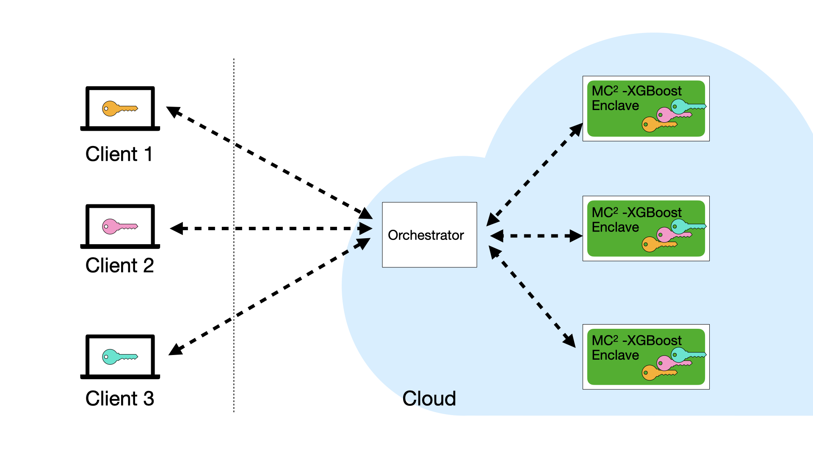

####################
About Secure XGBoost
####################

Motivation
**********

Training a machine learning model requires a large quantity of high-quality data. One way to achieve this is to combine data from many different data organizations or data owners. But data owners are often unwilling to share their data with each other due to privacy concerns, which can stem from business competition, or be a matter of regulatory compliance.

The question is: how can we mitigate such privacy concerns?

Secure collaborative learning enables many data owners to **build robust models on their collective data, but without revealing their data to each other**. Banks can collaborate on anti-money laundering efforts while keeping their customer data private. Healthcare institutions can pool their patient data together and collaborate on medical studies. The possibilities are vast and promising.

Secure XGBoost
**************

In a nutshell, multiple clients (or data owners) can use Secure XGBoost to collaboratively train an XGBoost model on their collective data in a cloud environment, while preserving the privacy of their individual data. Secure XGBoost also supports a single party who simply wants to outsource computation to the cloud but who doesn't want to transfer data to the cloud in plaintext. 

At its core, Secure XGBoost uses hardware enclaves (such as Intel SGX) to protect the data even in the presence of a hostile cloud environment. That is, even though the training runs in the cloud, each client's data remains hidden from the cloud provider and other clients. The clients orchestrate the training pipeline remotely but collaboratively, and Secure XGBoost guarantees that each client retains control of its own data.

Secure Enclaves
***************

Secure enclaves are a recent advance in computer processor technology that enables the creation of a secure region of memory (called an enclave) on an otherwise untrusted machine. Any data or software placed within the enclave is isolated from the rest of the system. No other process on the same processor -- not even privileged software such as the OS or the hypervisor -- can access that memory. Examples of secure enclave technology include Intel SGX, ARM TrustZone, and AMD Memory Encryption.

Moreover, enclaves typically support a feature called remote attestation. This feature enables clients to cryptographically verify that an enclave in the cloud is running trusted, unmodified code.

Secure XGBoost builds upon the `Open Enclave SDK <https://openenclave.io/sdk/>`_ -- an open source SDK that provides a single unified abstraction across different enclave technologies. The use of Open Enclave enables our library to be compatible with many different enclave backends, such as Intel SGX and OP-TEE.

Mitigating side-channel attacks
*******************************

On top of the enclaves, Secure XGBoost adds a second layer of security that additionally protects the data and computation against a large class of attacks on enclaves.

Researchers have shown that attackers may be able to learn sensitive information about the data within SGX enclaves by leveraging auxiliary sources of leakage (or “side-channels”), even though they can’t directly observe the data. Memory access patterns are an example of such a side-channel. 

In Secure XGBoost, we design and implement data-oblivious algorithms for model training and inference. At a high level, our algorithms produce an identical sequence of memory accesses, regardless of the input data. As a result, the memory access patterns reveal no information about the underlying data to the attacker.

However, the extra security comes at the cost of performance. If such attacks fall outside the users’ threat model, then they can disable this extra protection if they wish.

System Architecture
*******************

A deployment of Secure XGBoost consist of the following entities: (i) multiple data owners (or clients) who wish to collaboratively train a model on their individual data; and (ii) an untrusted cloud service that hosts the Secure XGBoost platform within a cluster of enclave machines, along with an orchestrator service outside the enclaves to mediate communication.

- **Clients.** A client refers to a data owner that participates in the collaborative learning process along with other clients. The clients collectively execute the computation pipeline on the Secure XGBoost platform by remotely invoking its APIs. 

- **Cloud service with enclaves.** The cloud service consists of a cluster of virtual machines, each hosting Secure XGBoost inside a hardware enclave. During training and inference, Secure XGBoost distributes the computation across the cluster of enclaves. Enclaves communicate with each other over TLS channels that begin and end inside the enclaves. The cloud also hosts an untrusted orchestrator service. The orchestrator mediates communication between clients and the Secure XGBoost platform deployed within enclaves.

Workflow
********
The clients each upload their encrypted data to the cloud service, and then collectively invoke the Secure XGBoost API to process their data. An end-to-end example workflow is as follows:

.. image:: images/workflow.gif
   :scale: 60%
   :alt: Workflow
   :align: center

1. **Clients attest the enclaves on the cloud** (via the enclave's remote attestation procedure) to verify that the expected Secure XGBoost code has been securely loaded within each enclave. As part of the attestation, they receive a public key *pk* from the enclaves. Each client generates a symmetric key *k_i*, encrypts it using *pk*, and sends it to Secure XGBoost. 

2. **Clients upload their encrypted data to cloud storage**. Each client *C_i* encrypts its data with their symmetric key *k_i* and uploads it to cloud storage. 

3. **The clients collectively orchestrate data processing**. The clients agree on a predetermined sequence of commands (a command is an XGBoost API call) that will be jointly executed on their data:

   * Each client submits a signed command to the orchestrator, which relays it to Secure XGBoost. Secure XGBoost authenticates the signatures, and then executes the command.
   * The results of the command (e.g., an encrypted trained model, or encrypted prediction results) are returned to the orchestrator, which relays them to the clients. 

   The process continues until all the commands have been executed.

User API
********
From a user's perspective, all of the complexities of the workflow above are abstracted away in the library, and using the library is very simple. For the most part, Secure XGBoost preserves the API exposed by regular XGBoost, requiring only minimal additions to work in the multiparty setting with enclaves. 

