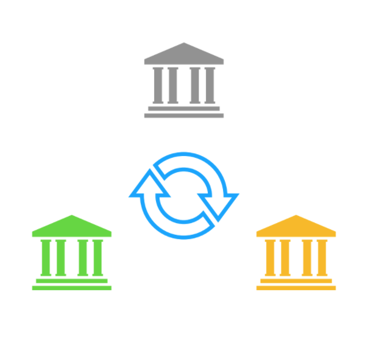
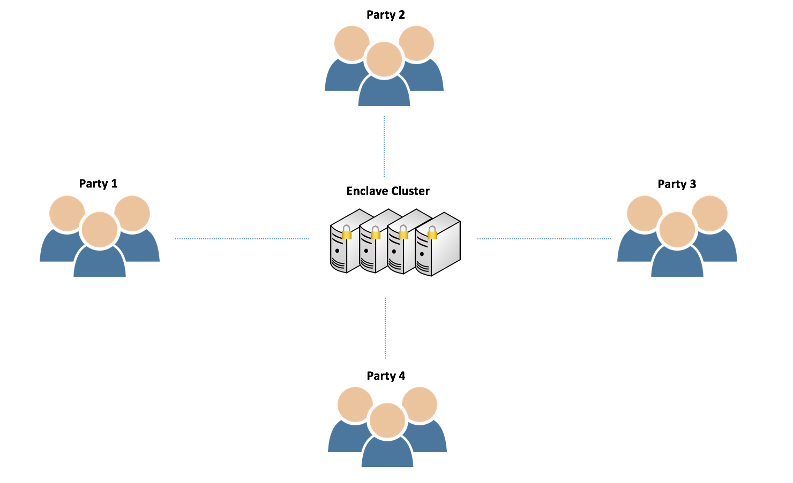

####################
About Secure XGBoost
####################

**Secure XGBoost** enables collaborative `gradient boosting <https://en.wikipedia.org/wiki/Gradient_boosting>`_ in the multiparty setting, leveraging `hardware enclaves <https://inst.eecs.berkeley.edu/~cs261/fa18/slides/Hardware_Enclaves.pdf>`_ and `data oblivious algorithms <https://www.usenix.org/system/files/conference/usenixsecurity16/sec16_paper_ohrimenko.pdf>`_ to securely perform this joint computation. In particular, multiple parties can collaborate to compute a joint model on their sensitive data without revealing the contents of the data. 

For example, one can imagine a group of banks that wants to jointly train an anti-money laundering machine learning model. This would require each bank to share its customer data. However, legal policies and privacy concerns prevent banks from sharing customer data in plaintext -- they should not revealto another bank, for example, the amount in a customer's savings account or a customer's recent transactions. Therefore, banks must jointly compute on all their sensitive data without explicitly sharing the data itself. This scenario can be generalized to a wide number of other industries in which parties may not want to share data because of data privacy laws or business competition: hospitals developing a disease diagnosis model, telecom companies predicting link failures, etc. 

With Secure XGBoost, a party or mutually distrustful federation can outsource computation on sensitive data to an untrusted cloud service without concern for information leakage. Secure XGBoost takes the encrypted sensitive data that is transferred to the untrusted cloud and loads it into a secure enclave, where it is then decrypted and computed upon. Assuming trust in the hardware vendor, enclaves provide a trusted execution environment even in the presence of a malicious host that has compromised nearly the entire software stack, including the operating system, the hypervisor, and other processes on the same machine. Since sensitive data sent over the network is encrypted and not seen in plaintext until it's inside a trusted enclave, the data of any party is not seen by any other entity. Furthermore, all computation happens inside an enclave, so all intermediate calculations that could otherwise leak some attributes of the data are also hidden.

Unfortunately, enclaves are vulnerable to side channel attacks. Prior work has shown that significant information can be inferred just from side channels [`1 <https://www.microsoft.com/en-us/research/wp-content/uploads/2016/02/MSR-TR-2015-70.pdf>`_, `2 <https://www.ieee-security.org/TC/SP2015/papers-archived/6949a640.pdf>`_]. As a result, Secure XGBoost provides the option of oblivious training and inference, leveraging algorithms that execute independently of input data and therefore do not leak access patterns. Oblivious algorithms protect against many side channel attacks, adding another layer of security to the system. 
