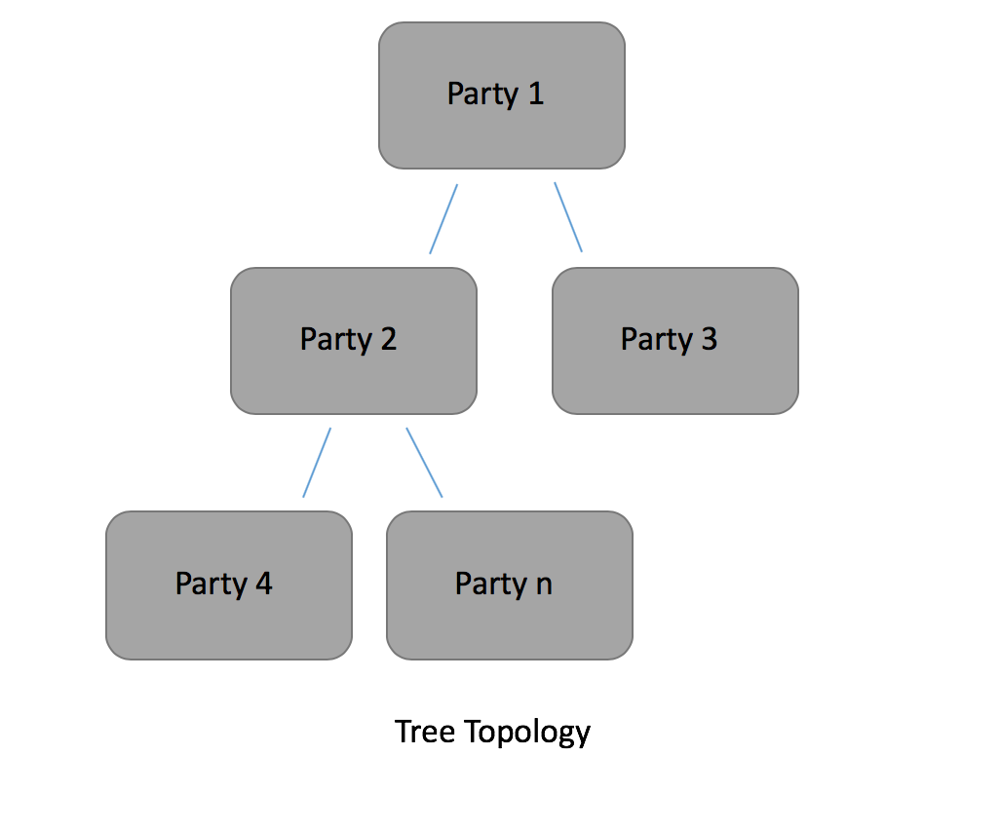
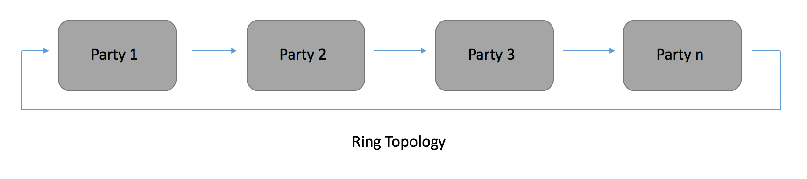

##########################
Distributed Secure XGBoost
##########################

Secure XGBoost is horizontally scalable -- if you want to train on more data, you can simply add more machines to the enclave cluster. Of course, the presence of an enclave cluster means that training will happen in a distributed manner. XGBoost itself already supports distributed training, and this project has adopted the native distributed training/inference logic and made it more secure.

Additionally, all communication within the cluster is encrypted and happens over TLS. Each communication channel begins and ends inside an enclave, so data communicated between enclaves are never exposed to an untrusted host. 

**Contents**

* `Architecture`_

* `Distributed Training`_

* `Tutorial`_

* `Troubleshooting`_

************
Architecture
************
Distributed Secure XGBoost leverages a tracker to configure the cluster. This involves setting up the cluster topology, i.e. the communication patterns: depending on the data size, the tracker may either set up the nodes in a tree pattern or a ring pattern.

Once the topology has been set up, each node in the cluster is assigned a rank. The rank is essentially the node identifier in the cluster. The node assigned rank 0 is considered the "master" node, and all other nodes are considered worker nodes.

The tracker is logically distinct from all nodes in the cluster, and does not actually perform any computation. Once it has finished setting up the topology, the tracker has finished its job. However, a user may choose to colocate the tracker with a master/worker node for simplicity. 

Before training begins, the tracker first logs into each node in the cluster via SSH and configures it for distributed training. Distributed Secure XGBoost then leverages *inter-enclave attestation* to authenticate all enclaves in the cluster -- each enclave attests all neighboring enclaves to verify the enclave's identity and to verify that the enclave will be running the proper code. During attestation, enclaves establish TLS connections with one another, enabling a secure channel to communicate on while training. 
   
********************
Distributed Training
********************

In the distributed setting, distributed training occurs by partitioning a subset of the training data to each node -- each node is responsible for some chunk of the training data when computing the global model. 

During training, the nodes compute a global model by iteratively communicating optimal feature splits to neighboring nodes. These splits are aggregated at the master node through the Allreduce paradigm, enabling the computation of a globally optimal feature split per iteration. This exchange of local optimal feature splits gradually builds up a tree, and a tree ensemble is built up with gradient boosting to form a model. 

.. image:: images/step1.png
   :width: 100% 
   :alt: Step 1

.. image:: images/step2.png
   :width: 100% 
   :alt: Step 2 

.. image:: images/step3.png
   :width: 100% 
   :alt: Step 3

.. image:: images/step4.png
   :width: 100% 
   :alt: Step 4 

For more information on the distributed training algorithm, see section 3 of the `original XGBoost paper <https://arxiv.org/pdf/1603.02754.pdf>`_. 

********
Tutorial
********
This tutorial demonstrates how to run Distributed Secure XGBoost. The tutorial code is located at ``demo/python/distributed/``.

If you are using Azure Confidential Computing, all your VMs must be on the same subnet.

1. Modify ``demo/python/distributed/hosts.config`` to contain the IP addresses of the nodes in your cluster. For example, if the nodes in your cluster have IP addresses of ``13.95.157.223`` and ``40.68.135.193``, your ``hosts.config`` should look like the following.

   .. code-block:: none
      
      13.95.157.223:22
      40.68.135.193:22

2. Ensure that ``distr-training.py`` is identical and at the same path on every machine in the cluster. 

3. Start computation. This will start the tracker and subsequently the job.

   .. code-block:: bash

      mc2-xgboost/host/dmlc-core/tracker/dmlc-submit --cluster ssh --host-file hosts.config --num-workers <num_nodes_in_cluster> --worker-memory 4g python3 distr-training.py

   The command takes in the following arguments:

         * ``--cluster`` : how the cluster is set up. In Secure XGBoost we leverage SSH for intra-cluster communication. 

         * ``--host-file`` : the path to the file containing the IP addresses / ports of all nodes in the cluster. 

         * ``--num-workers``  : the number of nodes in the cluster

         * ``--worker-memory`` : the amount of memory to allocate to the job on each machine.

   Ensure that each node in the cluster has authorized the SSH public key of the machine running the tracker, as the tracker in Distributed Secure XGBoost leverages SSH public keys to set up the topology.

   Note that this tutorial can also be run locally by simulating the cluster on one machine. To do this, type in the following command.

   .. code-block:: bash

      mc2-xgboost/host/dmlc-core/tracker/dmlc-submit --cluster local --num-workers <num_nodes_in_cluster> --worker-memory 1g python3 distr-training.py

  

***************
Troubleshooting
***************
1. **Permission denied**

   This may be symptomatic of an SSH authentication error. Be sure that the SSH public key of the machine running the tracker is in the ``~/.ssh/authorized_hosts`` file of each node in the cluster.

2. **Hung connection**

   If the tracker is hung after logging a statement similar to ``start listen on ...``, the tracker may be hung listening for an initial signal from a node in the cluster. Ensure that ports 9000-9100 are open on each machine.

