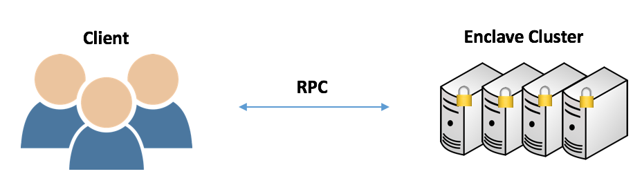

##################################
Outsourced Distributed Computation
##################################

Secure XGBoost is tailored toward an outsourced computation model -- one in which a client with sensitive data wants to outsource computation on the sensitive data to an untrusted server with a trusted hardware enclave. With a lot of training data, a cluster of machines, as opposed to a single server, may have to be used. This tutorial provides an example of such a scenario. 

**Contents**

* `Architecture`_

* `Tutorial`_

  - `Cluster Setup`_
  - `Client Setup`_

* `Troubleshooting`_

************
Architecture
************
In this scenario there's a client and an enclave cluster. The client communicates with each machine in the cluster over RPC, and the nodes in the cluster communicate with one another over TLS channels that begin and end inside an enclave.

Before computation, one node in the cluster will initialize a tracker to start an RPC server on each node in the cluster. The tracker is discussed in the :doc:`Distributed Secure XGBoost tutorial <distributed>`.

Each RPC server will listen for client requests. The client will make requests for remote attestation, adding its symmetric key used to encrypt the training data to each enclave, and the end-to-end training process. 

The client will first attest each enclave, then encrypt the data and send it to the cluster. The data remains encrypted until an enclave at each machine loads a part of the data, at which point the enclave can decrypt the data using the symmetric key sent by the client over RPC. Once the client has given the start signal to each node over RPC, the cluster will then collectively train a model on the training data following the distributed training pattern outlined in the :doc:`Distributed Secure XGBoost tutorial <distributed>`. Lastly, an encrypted version of the trained model will be saved, available for the client to fetch. 

********
Tutorial
********
If you are using Azure Confidential Computing, all your VMs must be on the same subnet.

We'll first set up the enclave cluster, and then set up the client.

Cluster Setup
=============
We'll need to start an RPC process on each node in the cluster to listen for client calls.

1. On the tracker machine, modify ``demo/python/cluster-remote-control/hosts.config`` to contain the IP addresses of the nodes in your cluster. For example, if the nodes in your cluster have IP addresses of ``13.95.157.223`` and ``40.68.135.193``, your ``hosts.config`` should look like the following.

   .. code-block:: none

      13.95.157.223:22
      40.68.135.193:22

2. Start the RPC servers on all machines using the tracker.

   .. code-block:: bash

      mc2-xgboost/host/dmlc-core/tracker/dmlc-submit --cluster ssh --host-file hosts.config --num-workers <num_workers_in_cluster> --worker-memory 4g python3 server/enclave-cluster-serve.py

The code run by the cluster once the client makes the final call is in the ``cluster_demo()`` function in ``demo/python/cluster-remote-control/server/remote_attestation_server.py``. Note that in the ``cluster_demo()`` function, you need to specify from which location to load your data in in the DMatrix constructor. Choose a path, edit the path in the constructor, and remember it, as you will need this path as part of the client setup.

Note that each RPC server will be running on port 50051.

Client Setup
============

We'll be setting up the client so that it's ready to remotely initiate a job on its own data. **Before doing this setup, ensure that you've already setup the server.**

This setup will involve encrypting data on the client and transferring the data to each node in the cluster. In practice, the client could upload its encrypted data to a shared file storage that is mounted to each cluster node's filesystem.

``cd`` into the ``demo/python/cluster-remote-control/client`` directory to begin setup.

1. **Encrypt data locally.**

   Use the ``encrypt.py`` script to generate a key and encrypt the sample data (``demo/data/agaricus.txt.train``). It will output two files: 

   * ``key.txt`` : the key used to encrypt the data

   * ``train.enc`` : an encrypted version of the training data

   Run the following to encrypt.

   .. code-block:: bash

      python3 encrypt.py

2. **Send encrypted data to the cluster**

   We assume that there will be a mechanism to transfer the encrypted data to the cluster. For the purposes of this demo, the user can try, for example, ``scp`` to simulate this transfer. Note that you will have to ``scp`` the files to the location you specified in the ``DMatrix`` constructor in the cluster setup.

3. **Make client calls**

   On the client, make the aforementioned calls to the server. The ``remote_attestation_client.py`` script takes in 3 arguments: the IP addresses of the nodes in the cluster, the path to the generated key, and the path to the keypair. We've included a sample keypair for this example.

   .. code-block:: bash

         python3 remote_attestation_client.py --ip-addr <ip_addr_1> <ip_addr_2> <ip_addr_n> --key key.txt --keypair keypair.pem

***************
Troubleshooting
***************

1. **gRPC channel failed to connect**
   
   Ensure that port 50051 is open and accessible on all machines in the enclave cluster, and that the IP addresses you passed to the client script are indeed those of the machines in the cluster.
